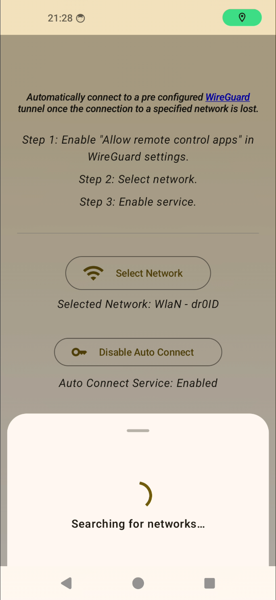
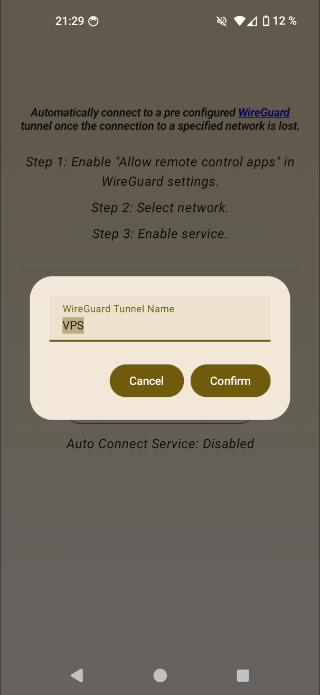

### WG Auto Connect

A small utility app that will automatically connect/disconnect to a specified WireGuard tunnel, once
the connection to a pre selected network is lost/established.

## Screenshots

    
    
    

